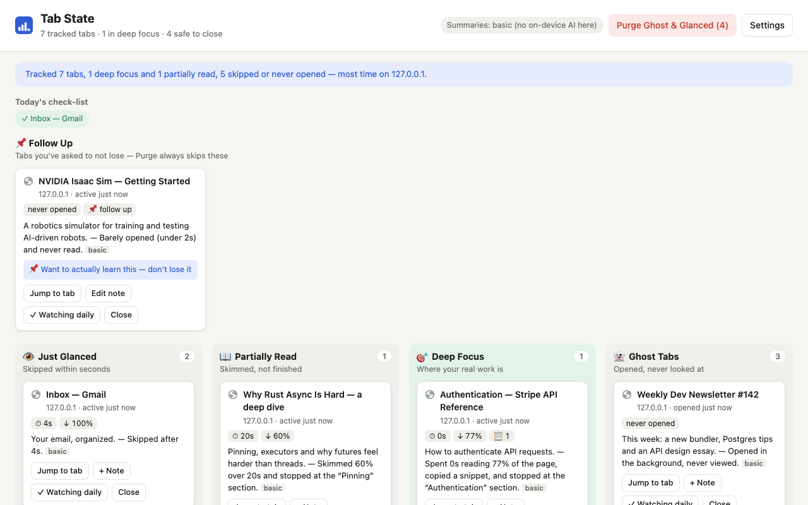
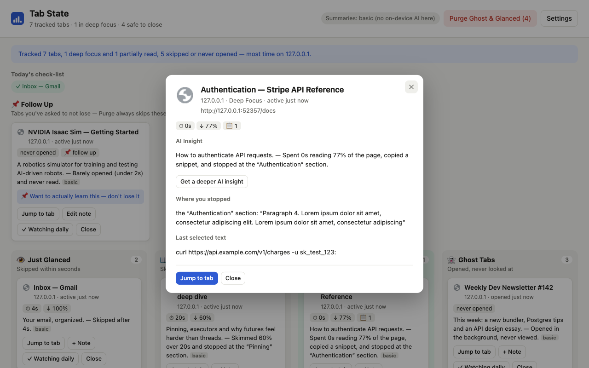
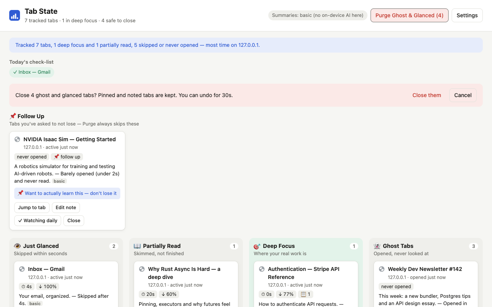
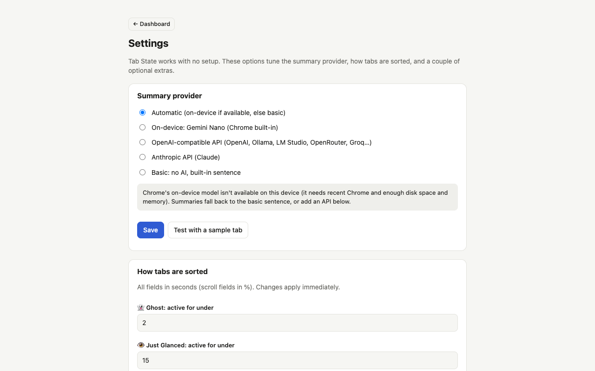

# Tab State

[](https://github.com/asyau/tab-state/actions/workflows/test.yml)
[](LICENSE)

**Your tabs, sorted by how you actually used them — and exactly where you stopped.**

Most tab managers sort by *what a page is* (work, social, news). Tab State sorts by *what you did
with it*: glanced at it for two seconds, skimmed half of it, read it closely and copied a snippet,
or never opened it at all. Come back after a lunch break, a meeting, or a weekend and the
dashboard tells you which handful of tabs mattered and where you left off, so you can close the
rest without worrying you're throwing something away.

Free, open source, works with no account and no setup. Everything stays on your machine unless you
choose to connect an AI provider.



## What you get

- **Four buckets, driven by behavior.** Active reading time (only while the tab is focused),
  scroll depth, and whether you copied or highlighted anything decide where a tab lands:
  👁️ Just Glanced · 📖 Partially Read · 🎯 Deep Focus · 👻 Ghost (never really looked at).
  The thresholds are editable.
- **A one-line summary that starts with what the page is about.** *"A robotics simulator for
  training and testing AI-driven robots. — Barely opened (under 2s) and never read."* Even a tab
  you ignored tells you what it was.
- **Click any card for details.** Where you stopped (the heading or code block nearest your
  scroll position), what you copied, your note, and an on-demand AI insight paragraph.
- **Purge with a safety net.** Close every Ghost and Glanced tab in one click, with a confirm
  step and a 30-second undo. Pinned tabs, the tab you're on, and anything with a note are never
  touched.
- **Follow-up notes.** Write *"want to actually learn this"* on a card and Tab State will never
  suggest closing it, no matter how little you looked at it.
- **Session recap.** One line summarizing your whole session: what you focused on and what you
  skipped.
- **Daily check-list.** Mark sites you want to look at every day; the dashboard shows which ones
  you haven't opened yet today.
- **Optional AI tab grouping.** Off by default. When you turn it on and click the button, it
  proposes groups, shows them to you, and only applies them if you confirm.

<table>
  <tr>
    <td width="50%"><br><sub>Detail view: an insight, where you stopped, what you copied</sub></td>
    <td width="50%"><br><sub>Purge asks first, and can be undone</sub></td>
  </tr>
  <tr>
    <td colspan="2"><br><sub>Settings: pick a summary provider, tune the thresholds</sub></td>
  </tr>
</table>

## Install

**Chrome Web Store:** *(link coming once it's published)*

**From source** (works today, needs Chrome 116+):

```bash
git clone https://github.com/asyau/tab-state.git
```

1. Open `chrome://extensions/` and turn on **Developer mode** (top right)
2. Click **Load unpacked** and choose the `tab-state` folder
3. Browse normally for a few minutes, then click the Tab State icon (or press `Alt+Shift+S`)

After pulling new changes, click the reload icon on the extension's card in `chrome://extensions/`.

## How tabs are sorted

| Bucket | Rule (defaults, editable in Settings) |
|---|---|
| 🎯 Deep Focus | Copied or highlighted text, or 90s+ active, or 70%+ scrolled with 30s+ active |
| 👻 Ghost | Active for under 2s |
| 📖 Partially Read | 15s+ active, or 25%+ scrolled with 5s+ active |
| 👁️ Just Glanced | Everything else |

"Active time" counts only while the tab is visible and its window is focused. It pauses when you
switch apps or lock your screen, but **not** when you sit still reading without touching the mouse
(see [Design notes](#design-notes)).

## AI summaries (optional)

Tab State writes its one-line summaries without any AI. If you want more natural sentences,
insights and grouping, pick a provider in **Settings**:

| Provider | Notes |
|---|---|
| **On-device (Gemini Nano)** | Built into recent Chrome, free, nothing leaves your machine. Needs a one-time model download and a capable device. |
| **OpenAI-compatible API** | OpenAI, OpenRouter, Groq, or a local server such as Ollama or LM Studio. Ollama needs no key (start it with `OLLAMA_ORIGINS="chrome-extension://*"`). |
| **Anthropic API** | Claude models, bring your own key. |

With a cloud provider, Tab State sends page titles, domains, descriptions, your engagement numbers
and your notes. It **never** sends page body text or the text you selected. Details, and exactly
what each feature sends, are in the [privacy policy](PRIVACY.md).

## Design notes

**Time is tracked with timestamps, never a running counter.** Chrome can shut an extension's
background worker down at any moment, so a focused tab stores `activeSince`; when focus leaves,
the elapsed time is added and the field cleared. If the *ending* event never arrives (sleep, crash,
force-quit) a 15-second heartbeat caps how far a segment can be back-dated, so a laptop closed
overnight adds seconds, not hours.

**Only a locked screen pauses tracking, not mouse or keyboard inactivity.** Chrome's `idle` state
fires after about a minute without input, but someone deep in a long article often doesn't touch
the mouse for minutes. Treating that as "away" would undercount exactly the reading this tool is
meant to surface.

**Records are keyed by normalized URL, not tab id**, because tab ids mean nothing after a restart.
Restored tabs are matched back to their history by URL as they load.

**Closing tabs is guarded against a real race.** `chrome.tabs.remove()` is asynchronous, so a
straggling update event for a tab mid-removal could look like a brand-new tab and create a
duplicate record. Tab ids being removed are held in a short-lived guard until Chrome confirms.

**Topic context uses the page's own metadata only:** its meta description, falling back to its
`<h1>`. It is dropped when it merely repeats the title.

## Project layout

```
manifest.json           Manifest V3
background.js           service worker: wires Chrome events to the tracker
content.js              in every page: scroll depth, highlights, copies, reading position, topic
lib/tracker.js          the engine: active time, records, purge/restore, notes, watch-list
lib/classifier.js       pure classify()
lib/settings.js         provider, thresholds and feature toggles
lib/{store,template,config,url,format}.js
ai/providers.js         nano / OpenAI-compatible / Anthropic behind one interface
ai/prompt.js            what is (and is not) sent to a model
ui/dashboard.*          the board, detail view, recap, check-list
ui/settings.*           provider, thresholds, grouping toggle, data controls
scripts/package.mjs     builds the Chrome Web Store zip
tests/unit              node:test with a fake chrome.* API
tests/e2e               Playwright against the real extension in Chromium
docs/                   store submission text, screenshots, promo images
```

## Development

```bash
npm install                 # only needed for the browser tests (Playwright)
npx playwright install chromium

npm test                    # unit tests + package/manifest consistency checks, no browser needed
npm run test:e2e            # drives the real extension in Chromium and asserts on the dashboard
npm run test:real           # same, against real websites (needs internet)
npm run screenshots         # regenerate docs/screenshots (1280x800)
npm run promo               # regenerate docs/promo
npm run package             # build dist/tab-state-<version>.zip for the Web Store
npm run test:smoke          # (EXT_DIR=<unzipped package>) load a build and check it starts cleanly
```

CI runs `npm test` on every push. The package tests fail if the manifest points at a file that
doesn't exist, if a permission isn't justified in the store submission doc, or if an import
wouldn't resolve inside the zip.

## Publishing

See [`docs/chrome-web-store-submission.md`](docs/chrome-web-store-submission.md) for the store
listing text, the single-purpose declaration, per-permission justifications and the asset
checklist, and [`docs/launch-posts.md`](docs/launch-posts.md) for ready-to-post announcements.

## Roadmap

- **Hosted "Pro" summaries** for people who'd rather not bring an API key (a small proxy plus a
  paywall). The extension side is already just another OpenAI-compatible endpoint.
- **MCP server** so an assistant can answer "what was I reading last week?". A browser extension
  can't host a server itself, so this needs a small companion process bridged with Chrome's Native
  Messaging.
- Learning from which tabs you flag, so it can suggest them.

## License

[MIT](LICENSE)
