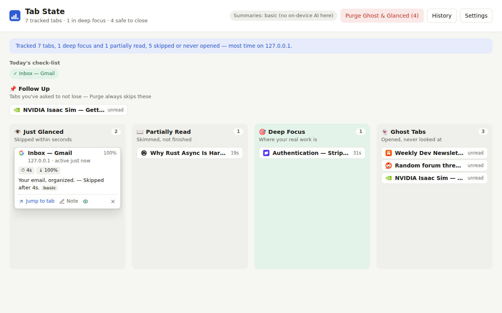
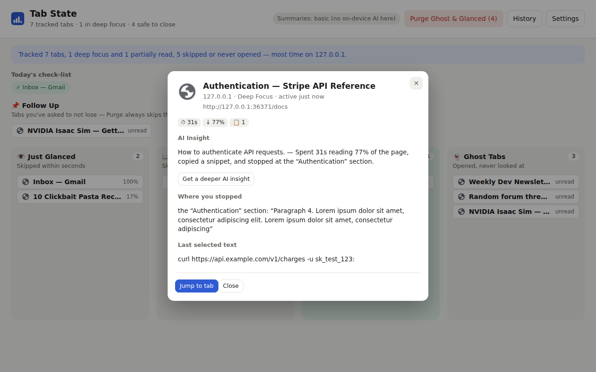
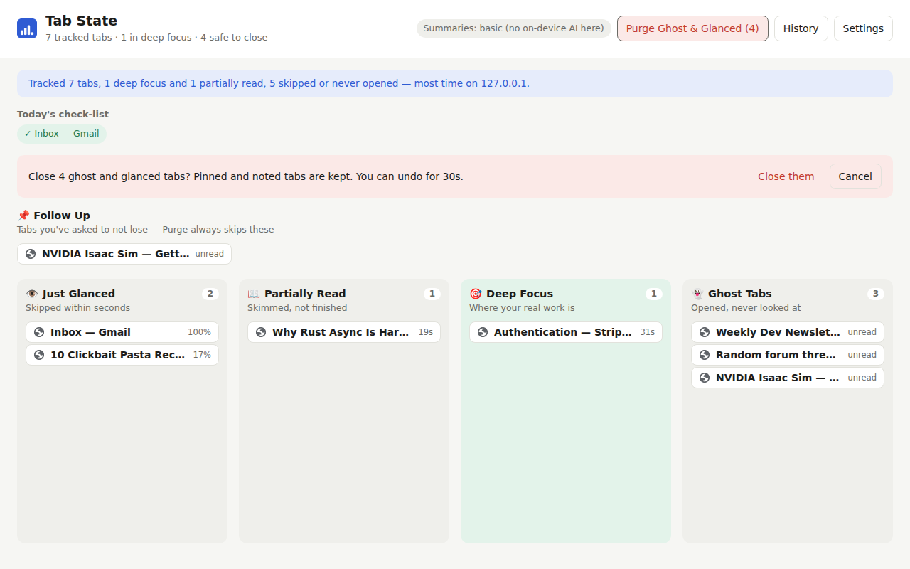

<p align="center">
  
</p>

<h1 align="center">Tab State</h1>

<p align="center">
  <b>Your tabs, sorted by how you actually used them — and exactly where you stopped.</b><br>
  A Chrome extension that knows the difference between the tab you read for 20 minutes and the one you opened and forgot.
</p>

<p align="center">
  <a href="https://github.com/asyau/tab-state/actions/workflows/test.yml"></a>
  <a href="LICENSE"></a>
  
  
  <a href="#-ask-your-ai-about-your-tabs"></a>
</p>

<p align="center">
  <a href="#-install">Install</a> ·
  <a href="#-what-you-get">Features</a> ·
  <a href="#-ask-your-ai-about-your-tabs">Use with Claude / ChatGPT</a> ·
  <a href="#-how-tabs-are-sorted">How it works</a> ·
  <a href="PRIVACY.md">Privacy</a>
</p>

<p align="center">
  
</p>

---

## Why

Most tab managers sort by *what a page is* — work, social, news. Tab State sorts by **what you did
with it**. Come back after lunch, a meeting, or a weekend and the dashboard shows the handful of
tabs that mattered and where you left off, so you can close the rest without the "what if I needed
that" feeling.

| 😩 40 tabs, no idea which ones matter | ✨ With Tab State |
|---|---|
| Every tab looks equally important | **🎯 Deep Focus** — the 4 you actually read, copied from, highlighted |
| You keep the rest "just in case" | **👻 Ghost** / **👁️ Just Glanced** — close them all in one click (with undo) |
| "Where was I in that doc?" | **Where you stopped** — the heading or code block you scrolled to |
| "What was that article last Tuesday?" | **History** — every tab, forever, by day · or just **ask Claude / ChatGPT** |

Free and open source. No account, no setup, no telemetry. **Everything stays on your machine**
unless you choose to connect an AI provider.

## 🧰 What you get

<table>
<tr>
<td width="50%" valign="top">

**📊 Four buckets, driven by behavior**<br>
Active reading time (only while the tab is really in front of you), scroll depth, and copy or
highlight activity decide where a tab lands. Thresholds are editable.

</td>
<td width="50%" valign="top">

**📏 Compact rows — see every tab at once**<br>
One line per tab: title plus one number (reading time, scroll %, or *unread*). Hover or Tab onto
a row and the full card opens *over* the list — nothing else moves. Click to pin it open.

</td>
</tr>
<tr>
<td valign="top">

**📝 A summary that says what the page was**<br>
*"A robotics simulator for training AI-driven robots. — Barely opened and never read."* Even a
tab you ignored tells you what it was.

</td>
<td valign="top">

**📍 Where you stopped**<br>
The details view shows the section you scrolled to, the last thing you copied, your note, and an
on-demand AI insight.

</td>
</tr>
<tr>
<td valign="top">

**🧹 Purge with a safety net**<br>
Close every Ghost and Glanced tab in one click — with a confirm step and a 30-second undo. Pinned
tabs, the tab you're on, and anything with a note are never touched.

</td>
<td valign="top">

**🗂️ Full history, kept forever**<br>
Every tab you've ever tracked, by day — repeat visits folded per site, a bar of where each day's
reading time went, search and filters, and a details panel that follows your cursor or ↑/↓.

</td>
</tr>
<tr>
<td valign="top">

**📌 Follow-up notes · ✅ Daily check-list**<br>
Note *"want to actually learn this"* and it's never suggested for closing. Mark sites you want to
check daily and see which you haven't opened yet today.

</td>
<td valign="top">

**🤖 Optional AI, your choice of provider**<br>
Nicer summaries, a one-line session recap, and tab grouping you confirm before it's applied — via
on-device Gemini Nano, OpenAI-compatible APIs (incl. local Ollama), or Claude.

</td>
</tr>
</table>

<table>
  <tr>
    <td width="50%"><br><sub>Details: an insight, where you stopped, what you copied</sub></td>
    <td width="50%"><br><sub>Purge asks first, and can be undone</sub></td>
  </tr>
</table>

## 🚀 Install

**Chrome Web Store:** *(link coming once it's published)*

**From source** — works today, needs Chrome 116+:

```bash
git clone https://github.com/asyau/tab-state.git
```

1. Open `chrome://extensions/` and turn on **Developer mode** (top right)
2. Click **Load unpacked** and choose the `tab-state` folder
3. Browse normally for a few minutes, then click the Tab State icon — or press **`Alt+Shift+S`**

After pulling new changes, click the ↻ reload icon on the extension's card in `chrome://extensions/`.

## 💬 Ask your AI about your tabs

> **You:** what was I reading about Rust async last week, and where did I stop?<br>
> **Claude:** *"Why Rust Async Is Hard"* on rustlang.blog — you read about 35% over two visits and
> stopped at the **Pinning** section. You also skimmed the Tokio tutorial but left after 20s.

Tab State ships a small **MCP server** that runs on your machine and gives your AI assistant four
read-only tools over your tracked tabs: `search_tabs`, `list_tabs`, `get_tab`, `get_session_recap`.
First turn on **Settings → MCP server** in the extension (it's off by default), then connect your
assistant:

| Assistant | How to connect |
|---|---|
| **Claude Desktop** | One click: build the installer (`cd mcp-server && npm install && npm run build:mcpb`), then **Settings → Extensions → Install Extension** and pick `mcp-server/dist/tab-state-mcp-1.0.0.mcpb`. |
| **Claude Code** | Plugin: `/plugin marketplace add asyau/tab-state` then `/plugin install tab-state@tab-state` |
| **Codex** (OpenAI's CLI / IDE / app) | Plugin: `codex plugin marketplace add asyau/tab-state` then `codex plugin add tab-state@tab-state` |
| **ChatGPT** (web, developer mode) | ChatGPT only reaches MCP servers over HTTPS, so run the server in remote mode (`cd mcp-server && npm install && npm run remote`) and expose it with a tunnel. [Step-by-step and security notes →](mcp-server/README.md#chatgpt-remote-mode) |
| Anything else that speaks MCP | `node mcp-server/server.mjs` over stdio — see [`mcp-server/README.md`](mcp-server/README.md) |

The Claude Code and Codex plugin is one folder ([`plugins/tab-state`](plugins/tab-state)): it
bundles the server as a single file (just needs Node 18+, no `npm install`) and a skill that
teaches the assistant when and how to use the tools. Several assistants can run at once — they
share the same data.

Nothing leaves your machine except in ChatGPT's remote mode, which serves the tools through a
tunnel you run, behind a secret URL. Raw page text and anything you selected are **never** synced.

## 🔍 How tabs are sorted

| Bucket | Rule (defaults, editable in Settings) |
|---|---|
| 🎯 **Deep Focus** | Copied or highlighted text after 30s+ active, or 90s+ active on its own, or 70%+ scrolled with 30s+ active |
| 📖 **Partially Read** | 15s+ active, or 25%+ scrolled with 5s+ active |
| 👁️ **Just Glanced** | Everything else |
| 👻 **Ghost** | Active for under 2s |

"Active time" counts only while the tab is visible and its window is focused. It pauses when you
switch apps or lock your screen, but **not** when you sit still reading without touching the mouse
(see [design notes](#design-notes)).

## 🤖 AI summaries (optional)

Tab State writes its one-line summaries without any AI. For more natural sentences, insights and
grouping, pick a provider in **Settings**:

| Provider | Notes |
|---|---|
| **On-device (Gemini Nano)** | Built into recent Chrome, free, nothing leaves your machine. Needs a one-time model download and a capable device. |
| **OpenAI-compatible API** | OpenAI, OpenRouter, Groq, or a local server such as Ollama or LM Studio. Ollama needs no key (start it with `OLLAMA_ORIGINS="chrome-extension://*"`). |
| **Anthropic API** | Claude models, bring your own key. |
| **Tab State Pro (hosted)** | No key needed; needs your own deployed proxy + an ExtensionPay subscription. See [below](#hosted-pro-tier-self-hosted). |

With a cloud provider, Tab State sends page titles, domains, descriptions, your engagement numbers
and your notes. It **never** sends page body text or the text you selected. Exactly what each
feature sends is in the [privacy policy](PRIVACY.md).

<details>
<summary><b>Hosted "Pro" tier (self-hosted)</b></summary>

A fourth provider, **Tab State Pro (hosted)**, needs no API key — summaries run through a small
proxy that holds the key for you, unlocked by an [ExtensionPay](https://extensionpay.com)
subscription. There's no public instance to subscribe to today: it's a self-hosted option for
anyone who wants to run their own "Pro" tier (their own Cloudflare account, Anthropic key and
ExtensionPay account). See [`pro-proxy/README.md`](pro-proxy/README.md) for how it works, how to
deploy it, and — importantly — its security model (ExtensionPay has no server-to-server
verification API, so this trusts the extension's own client-side payment check; that trade-off is
explained there in full).

</details>

<details>
<summary id="design-notes"><b>Design notes</b></summary>

**Time is tracked with timestamps, never a running counter.** Chrome can shut an extension's
background worker down at any moment, so a focused tab stores `activeSince`; when focus leaves,
the elapsed time is added and the field cleared. If the *ending* event never arrives (sleep, crash,
force-quit) a 15-second heartbeat caps how far a segment can be back-dated, so a laptop closed
overnight adds seconds, not hours.

**Only a locked screen pauses tracking, not mouse or keyboard inactivity.** Chrome's `idle` state
fires after about a minute without input, but someone deep in a long article often doesn't touch
the mouse for minutes. Treating that as "away" would undercount exactly the reading this tool is
meant to surface.

**Records are keyed by normalized URL, not tab id**, because tab ids mean nothing after a restart.
Restored tabs are matched back to their history by URL as they load.

**Closing tabs is guarded against a real race.** `chrome.tabs.remove()` is asynchronous, so a
straggling update event for a tab mid-removal could look like a brand-new tab and create a
duplicate record. Tab ids being removed are held in a short-lived guard until Chrome confirms.

**Topic context uses the page's own metadata only:** its meta description, falling back to its
`<h1>`. It is dropped when it merely repeats the title.

**Favicons come from Chrome's own favicon cache** (the `favicon` permission), so each row shows
the site's real icon without the dashboard ever requesting anything from the site.

</details>

<details>
<summary><b>Project layout</b></summary>

```
manifest.json           Manifest V3
background.js           service worker: wires Chrome events to the tracker
content.js              in every page: scroll depth, highlights, copies, reading position, topic
lib/tracker.js          the engine: active time, records, purge/restore, notes, watch-list
lib/classifier.js       pure classify()
lib/settings.js         provider, thresholds and feature toggles
lib/{store,template,config,url,format}.js
ai/providers.js         nano / OpenAI-compatible / Anthropic behind one interface
ai/prompt.js            what is (and is not) sent to a model
ui/dashboard.*          the board, detail view, recap, check-list
ui/card-peek.js         compact rows that open into full cards (hover intent, pin, keyboard)
ui/history.*            every tracked tab ever, grouped by day
ui/settings.*           provider, thresholds, grouping toggle, data controls
scripts/package.mjs     builds the Chrome Web Store zip
tests/unit              node:test with a fake chrome.* API
tests/e2e               Playwright against the real extension in Chromium
docs/                   store submission text, screenshots, promo images
mcp-server/             local MCP server (stdio + ChatGPT remote mode), Claude Desktop .mcpb
plugins/tab-state/      Claude Code + Codex plugin: bundled server, MCP config, skill
.claude-plugin/         Claude Code marketplace entry for the plugin
.agents/plugins/        Codex marketplace entry for the plugin
pro-proxy/              optional self-hosted "Pro" tier proxy (see pro-proxy/README.md)
```

</details>

<details>
<summary><b>Development</b></summary>

```bash
npm install                 # only needed for the browser tests (Playwright)
npx playwright install chromium

npm test                    # unit tests + package/manifest consistency checks, no browser needed
npm run test:e2e            # drives the real extension in Chromium and asserts on the dashboard
npm run test:real           # same, against real websites (needs internet)
npm run screenshots         # regenerate docs/screenshots (1280x800, real site favicons)
npm run promo               # regenerate docs/promo
npm run package             # build dist/tab-state-<version>.zip for the Web Store
npm run test:smoke          # (EXT_DIR=<unzipped package>) load a build and check it starts cleanly

cd mcp-server
npm test                    # MCP server, remote mode, and the plugin (manifests, bundle freshness)
npm run build:plugin        # rebuild plugins/tab-state/server/ after changing server.mjs/store.mjs
npm run build:mcpb          # Claude Desktop installer -> mcp-server/dist/ (needs @anthropic-ai/mcpb)
```

CI runs both test suites on every push. The package tests fail if the manifest points at a file
that doesn't exist, if a permission isn't justified in the store submission doc, or if an import
wouldn't resolve inside the zip; the plugin tests fail if the bundled server is stale.

Working on this repo with Claude Code? `.claude/settings.json` enables the
[UI/UX Pro Max](https://github.com/nextlevelbuilder/ui-ux-pro-max-skill) plugin for design work
(Claude Code asks you to trust the repo's settings first).

**Publishing:** [`docs/chrome-web-store-submission.md`](docs/chrome-web-store-submission.md) has
the store listing text, per-permission justifications and the asset checklist;
[`docs/launch-posts.md`](docs/launch-posts.md) has ready-to-post announcements; and
[`docs/verification-notes.md`](docs/verification-notes.md) lists exactly what's been verified live
versus reviewed only.

</details>

## 🗺️ Roadmap

- Learning from which tabs you flag, so it can suggest them.
- A published, official "Tab State Pro" you can subscribe to without deploying anything yourself.
- A published ChatGPT app, so ChatGPT works without running your own tunnel.

## License

[MIT](LICENSE) — made for people with too many tabs open. ⭐ Star the repo if it saves you from one.
